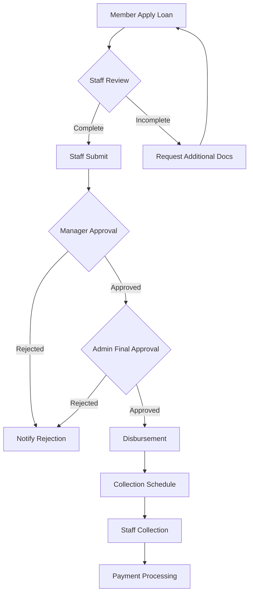
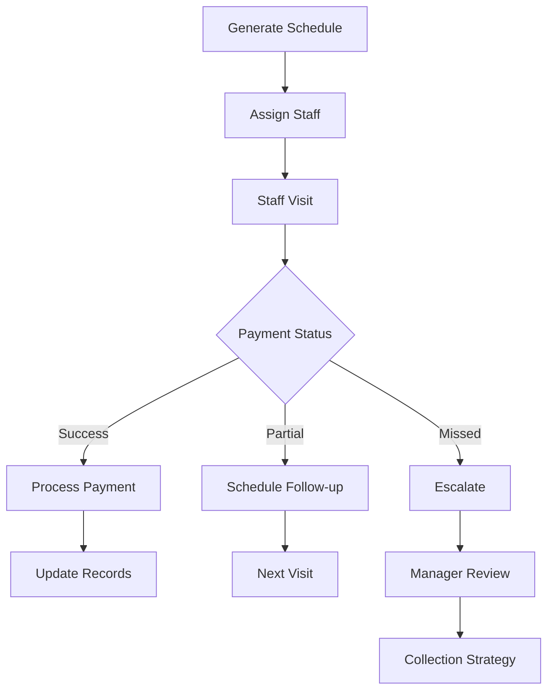
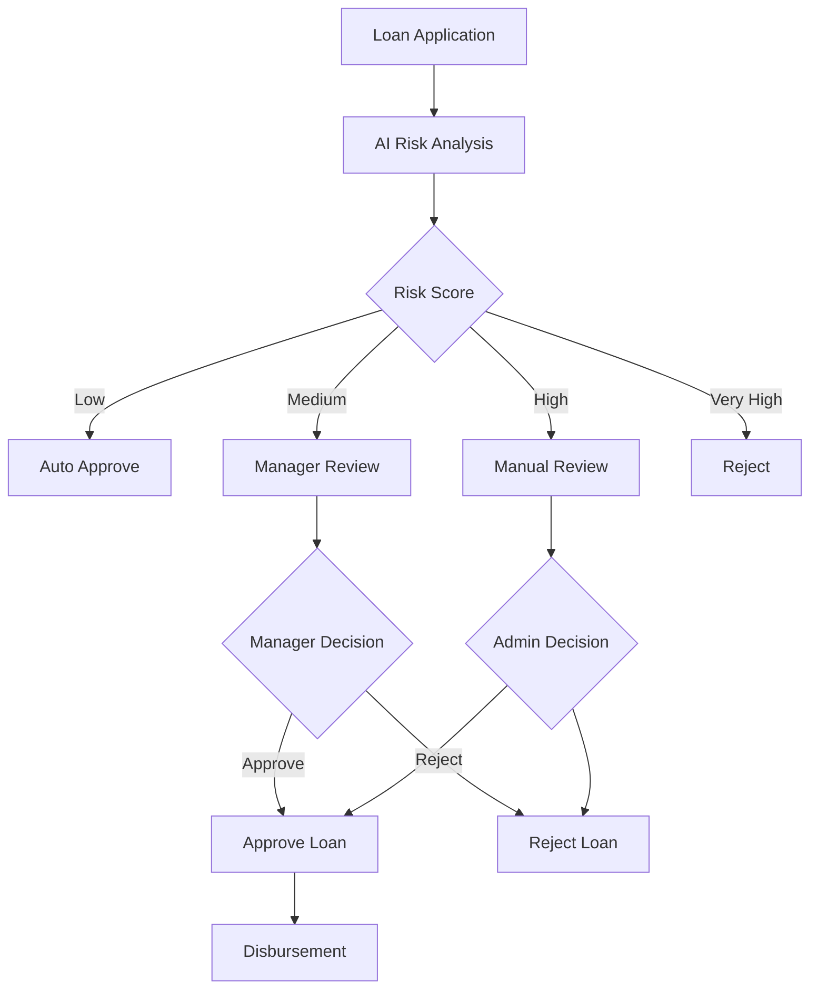

# 👥 **ROLES & FITUR APLIKASI KSP LAM GABE JAYA**

## 📋 **Table of Contents**

1. [Overview Sistem](#overview-sistem)
2. [Struktur Role](#struktur-role)
3. [Detail Role & Fitur](#detail-role--fitur)
4. [Matriks Akses](#matriks-akses)
5. [Alur Kerja](#alur-kerja)
6. [Fitur Spesial per Role](#fitur-spesial-per-role)
7. [Integrasi Sistem](#integrasi-sistem)

---

## 🏢 **Overview Sistem**

KSP Lam Gabe Jaya adalah **platform rentenir digital** yang dirancang khusus untuk model bisnis door-to-door dengan teknologi modern. Sistem ini menggabungkan **Progressive Web App (PWA)** dengan **AI-powered analytics** untuk memberikan layanan optimal bagi semua pengguna.

### 🎯 **Model Bisnis**
- **High-Interest Loans**: Pinjaman dengan bunga tinggi (2.5% - 5% per bulan)
- **Door-to-Door Service**: Kunjungan langsung ke nasabah
- **Daily/Weekly Collections**: Penagihan harian/mingguan
- **GPS Tracking**: Monitoring staff lapangan
- **AI Risk Assessment**: Evaluasi risiko otomatis

---

## 👥 **Struktur Role**

Sistem memiliki **8 role hierarchy** dengan tingkat akses yang berbeda:

```
👑 OWNER
├── 🏛️ SUPER ADMIN
├── 🎓 ADMIN
├── 📊 MANAGER
├── 💼 TELLER
├── 🚶 STAFF
└── 👤 MEMBER
```

### 📊 **Role Priority Levels**
1. **Owner** - Level 1 (Tertinggi)
2. **Super Admin** - Level 2
3. **Admin** - Level 3
4. **Manager** - Level 4
5. **Teller** - Level 5
6. **Staff** - Level 6
7. **Member** - Level 7 (Terendah)

---

## 🔐 **Detail Role & Fitur**

### 👑 **OWNER**

#### 📋 **Deskripsi Role**
- **Pemilik Bisnis**: Kontrol penuh atas seluruh operasional
- **Strategis**: Fokus pada growth dan profit maximization
- **Oversight**: Monitoring semua aspek bisnis

#### 🎯 **Fitur Utama**
```
✅ FULL SYSTEM ACCESS - Semua fitur tanpa batasan
✅ BUSINESS INTELLIGENCE - Analytics & AI insights
✅ FINANCIAL CONTROL - Laporan keuangan lengkap
✅ USER MANAGEMENT - Kelola semua users
✅ SYSTEM CONFIGURATION - Pengaturan sistem
✅ RISK MANAGEMENT - Manajemen risiko global
✅ REPORTING ACCESS - Semua laporan tersedia
✅ DECISION MAKING - Approval final semua keputusan
```

#### 📊 **Dashboard Khusus**
- **Revenue Overview**: Total pendapatan & profit margin
- **Portfolio Performance**: Performa pinjaman portfolio
- **Risk Analytics**: Distribusi risiko nasabah
- **Growth Metrics**: Pertumbuhan bisnis
- **AI Predictions**: Prediksi performa masa depan
- **Market Intelligence**: Analisis pasar & kompetisi

#### 🔧 **Akses System**
- **All APIs**: Full access ke semua endpoints
- **Database**: Direct database access
- **Configuration**: System settings & parameters
- **Export/Import**: Data export & import capabilities
- **Audit Logs**: Access ke semua activity logs

---

### 🏛️ **SUPER ADMIN**

#### 📋 **Deskripsi Role**
- **System Administrator**: Pengelola sistem teknis
- **Technical Oversight**: Monitoring & maintenance system
- **Security Management**: Keamanan & compliance sistem

#### 🎯 **Fitur Utama**
```
✅ SYSTEM ADMINISTRATION - Kelola sistem teknis
✅ USER MANAGEMENT - Create/manage semua users kecuali Owner
✅ DATABASE MANAGEMENT - Backup, restore, optimization
✅ SECURITY OVERSIGHT - Monitoring keamanan
✅ API MANAGEMENT - Kelola API endpoints
✅ SYSTEM HEALTH - Monitoring performa sistem
✅ LOG ACCESS - Access ke semua system logs
✅ CONFIGURATION - Pengaturan teknis sistem
```

#### 📊 **Dashboard Khusus**
- **System Health**: CPU, memory, database performance
- **API Statistics**: Usage & error rates
- **Security Alerts**: Suspicious activities
- **Database Metrics**: Query performance & storage
- **User Activities**: Login patterns & access logs
- **Backup Status**: Automated backup monitoring

#### 🔧 **Akses System**
- **Technical APIs**: System monitoring & management
- **Database Tools**: Query optimization & maintenance
- **Security Tools**: Access control & authentication
- **System Configuration**: Technical parameters
- **Log Management**: System & application logs

---

### 🎓 **ADMIN**

#### 📋 **Deskripsi Role**
- **Operational Manager**: Mengelola operasional harian
- **Team Leadership**: Mengawasi staff dan teller
- **Process Management**: Memastikan proses berjalan lancar

#### 🎯 **Fitur Utama**
```
✅ MEMBER MANAGEMENT - CRUD data nasabah
✅ LOAN MANAGEMENT - Approve & monitoring pinjaman
✅ STAFF SUPERVISION - Monitor staff performance
✅ COLLECTION OVERSIGHT - Monitor penagihan
✅ REPORTING - Laporan operasional lengkap
✅ WORKFLOW MANAGEMENT - Kelola alur kerja
✅ QUALITY CONTROL - Quality assurance
✅ TRAINING COORDINATION - Koordinasi training staff
```

#### 📊 **Dashboard Khusus**
- **Operational Metrics**: Daily/weekly performance
- **Staff Performance**: Productivity & efficiency
- **Loan Pipeline**: Application to disbursement
- **Collection Rates**: Payment collection efficiency
- **Member Analytics**: Nasabah demographics & behavior
- **Risk Dashboard**: Portfolio risk assessment

#### 🔧 **Akses System**
- **Member APIs**: Full CRUD nasabah
- **Loan APIs**: Create, approve, monitor pinjaman
- **Collection APIs**: Monitor collection activities
- **Reporting APIs**: Generate operational reports
- **Staff Management APIs**: Monitor & manage staff

---

### 📊 **MANAGER**

#### 📋 **Deskripsi Role**
- **Branch/Area Manager**: Mengelola area operasional tertentu
- **Performance Analysis**: Analisis performa tim
- **Strategic Planning**: Perencanaan strategis area

#### 🎯 **Fitur Utama**
```
✅ AREA MANAGEMENT - Kelola operasional area
✅ PERFORMANCE ANALYSIS - Analisis performa tim
✅ TARGET SETTING - Set target untuk staff
✅ RISK ASSESSMENT - Evaluasi risiko area
✅ CLIENT RELATIONS - Hubungan dengan nasabah prioritas
✅ RESOURCE ALLOCATION - Distribusi sumber daya
✅ COMPLIANCE MONITORING - Monitoring compliance
✅ MARKET ANALYSIS - Analisis pasar area
```

#### 📊 **Dashboard Khusus**
- **Area Performance**: Metrics per area/branch
- **Target Achievement**: Progress vs targets
- **Staff Productivity**: Efficiency per staff member
- **Portfolio Quality**: Risk distribution area
- **Market Penetration**: Coverage & growth area
- **Competitive Analysis**: Competitor monitoring

#### 🔧 **Akses System**
- **Area-specific APIs**: Data area tertentu
- **Performance APIs**: Analytics & reporting
- **Target Management APIs**: Set & monitor targets
- **Risk Assessment APIs**: Area risk evaluation
- **Market Intelligence APIs**: Market analysis tools

---

### 💼 **TELLER**

#### 📋 **Deskripsi Role**
- **Front Office**: Layanan langsung ke nasabah
- **Transaction Processing**: Proses transaksi harian
- **Customer Service**: Pelayanan nasabah

#### 🎯 **Fitur Utama**
```
✅ TRANSACTION PROCESSING - Proses transaksi
✅ CUSTOMER SERVICE - Layanan nasabah
✅ PAYMENT HANDLING - Terima pembayaran
✅ DOCUMENT MANAGEMENT - Kelola dokumen
✅ BASIC INQUIRY - Jawab pertanyaan dasar
✅ CASH MANAGEMENT - Kelola uang tunai
✅ RECORD KEEPING - Pencatatan transaksi
✅ ESCALATION - Eskalasi ke supervisor
```

#### 📊 **Dashboard Khusus**
- **Daily Transactions**: Transaksi hari ini
- **Cash Position**: Posisi kas harian
- **Customer Queue**: Antrian nasabah
- **Service Metrics**: Layanan performance
- **Payment Summary**: Ringkasan pembayaran
- **Task List**: Tugas harian

#### 🔧 **Akses System**
- **Transaction APIs**: Process payments & deposits
- **Customer APIs**: Basic customer data access
- **Reporting APIs**: Daily transaction reports
- **Queue Management APIs**: Customer queue system
- **Communication APIs**: Customer notifications

---

### 🚶 **STAFF**

#### 📋 **Deskripsi Role**
- **Field Officer**: Kunjungan door-to-door
- **Collection Agent**: Penagihan langsung
- **Sales Representative**: Pemasaran pinjaman

#### 🎯 **Fitur Utama**
```
✅ DOOR-TO-DOOR SERVICE - Kunjungan nasabah
✅ COLLECTION EXECUTION - Penagihan langsung
✅ GPS TRACKING - Pelaporan lokasi
✅ MOBILE TRANSACTIONS - Transaksi mobile
✅ CLIENT UPDATES - Update data nasabah
✅ SCHEDULE MANAGEMENT - Kelola jadwal kunjungan
✅ PERFORMANCE TRACKING - Track performa pribadi
✅ COMMUNICATION - Hubungi nasabah
```

#### 📊 **Dashboard Khusus**
- **Daily Schedule**: Jadwal kunjungan hari ini
- **Route Optimization**: Rute kunjungan optimal
- **Collection Targets**: Target penagihan harian
- **GPS Tracking**: Real-time location tracking
- **Performance Metrics**: Personal KPIs
- **Client List**: Daftar nasabah yang dikunjungi

#### 🔧 **Akses System**
- **Mobile APIs**: Mobile-first transaction APIs
- **GPS APIs**: Location tracking & reporting
- **Collection APIs**: Process collections on-field
- **Schedule APIs**: Daily visit management
- **Communication APIs**: Customer messaging

---

### 👤 **MEMBER**

#### 📋 **Deskripsi Role**
- **Nasabah**: Pengguna layanan koperasi
- **Self-Service**: Akses layanan mandiri
- **Account Management**: Kelola akun pribadi

#### 🎯 **Fitur Utama**
```
✅ ACCOUNT MANAGEMENT - Kelola profil pribadi
✅ LOAN APPLICATION - Ajukan pinjaman online
✅ PAYMENT VIEWING - Lihat riwayat pembayaran
✅ BALANCE CHECKING - Cek saldo & tagihan
✅ DOCUMENT UPLOAD - Upload dokumen
✅ NOTIFICATION CENTER - Notifikasi penting
✅ COMMUNICATION - Hubungi admin
✅ MOBILE ACCESS - Akses mobile PWA
```

#### 📊 **Dashboard Khusus**
- **Account Overview**: Informasi akun lengkap
- **Active Loans**: Pinjaman aktif & jadwal
- **Payment History**: Riwayat pembayaran
- **Application Status**: Status pengajuan
- **Notifications**: Alert & reminders
- **Quick Actions**: Aksi cepat penting

#### 🔧 **Akses System**
- **Account APIs**: Personal data management
- **Loan APIs**: Apply & track loan applications
- **Payment APIs**: View payment history
- **Document APIs**: Upload & manage documents
- **Notification APIs**: Receive alerts & updates

---

## 📋 **Matriks Akses**

### 🗂️ **CRUD Operations Matrix**

| Fitur | Owner | Super Admin | Admin | Manager | Teller | Staff | Member |
|-------|-------|-------------|-------|---------|--------|-------|--------|
| **Users Management** | ✅ | ✅ | ⚠️ | ❌ | ❌ | ❌ | ❌ |
| **Members CRUD** | ✅ | ✅ | ✅ | ⚠️ | ❌ | ❌ | 👤 |
| **Loans CRUD** | ✅ | ✅ | ✅ | ⚠️ | ❌ | ❌ | 👤 |
| **Payments CRUD** | ✅ | ✅ | ✅ | ⚠️ | ✅ | ⚠️ | 👤 |
| **Collections** | ✅ | ✅ | ✅ | ✅ | ❌ | ✅ | ❌ |
| **Reports** | ✅ | ✅ | ✅ | ⚠️ | ⚠️ | ❌ | ❌ |
| **Analytics** | ✅ | ✅ | ✅ | ✅ | ❌ | ❌ | ❌ |
| **System Config** | ✅ | ✅ | ❌ | ❌ | ❌ | ❌ | ❌ |

**Legend:**
- ✅ = Full Access
- ⚠️ = Limited Access
- ❌ = No Access
- 👤 = Self Only

### 🔐 **Security Access Matrix**

| Security Level | Owner | Super Admin | Admin | Manager | Teller | Staff | Member |
|----------------|-------|-------------|-------|---------|--------|-------|--------|
| **System Settings** | ✅ | ✅ | ❌ | ❌ | ❌ | ❌ | ❌ |
| **Database Access** | ✅ | ✅ | ❌ | ❌ | ❌ | ❌ | ❌ |
| **User Management** | ✅ | ✅ | ⚠️ | ❌ | ❌ | ❌ | ❌ |
| **Financial Data** | ✅ | ✅ | ✅ | ⚠️ | ⚠️ | ❌ | 👤 |
| **Personal Data** | ✅ | ✅ | ✅ | ⚠️ | ⚠️ | ⚠️ | 👤 |
| **Audit Logs** | ✅ | ✅ | ❌ | ❌ | ❌ | ❌ | ❌ |

---

## 🔄 **Alur Kerja**

### 📋 **Alur Pinjaman**



### 📋 **Alur Penagihan**



### 📋 **Alur Risk Assessment**



---

## 🌟 **Fitur Spesial per Role**

### 👑 **Owner Exclusive Features**
- **Profit Optimization Dashboard**: AI-powered profit maximization
- **Market Expansion Tools**: Geographic expansion analysis
- **Competitive Intelligence**: Competitor monitoring
- **Investment Analytics**: ROI & investment analysis
- **Business Intelligence**: Advanced BI & forecasting

### 🏛️ **Super Admin Exclusive Features**
- **System Architecture Management**: Multi-database oversight
- **Security Command Center**: Centralized security monitoring
- **Performance Optimization**: System performance tuning
- **Disaster Recovery**: Backup & recovery management
- **Compliance Reporting**: Regulatory compliance tools

### 🎓 **Admin Exclusive Features**
- **Workflow Automation**: Process automation tools
- **Quality Assurance**: Quality control systems
- **Training Management**: Staff training coordination
- **Resource Planning**: Resource allocation tools
- **Operational Intelligence**: Deep operational analytics

### 📊 **Manager Exclusive Features**
- **Team Performance Analytics**: Advanced team metrics
- **Target Management**: Goal setting & tracking
- **Market Analysis Tools**: Local market intelligence
- **Client Relationship Management**: High-value client tools
- **Competitive Benchmarking**: Area performance comparison

### 💼 **Teller Exclusive Features**
- **Cash Management Tools**: Cash flow optimization
- **Customer Service Analytics**: Service quality metrics
- **Transaction Efficiency**: Speed & accuracy tools
- **Queue Management**: Customer flow optimization
- **Compliance Checklist**: Regulatory compliance tools

### 🚶 **Staff Exclusive Features**
- **Route Optimization**: AI-powered route planning
- **Mobile Collection Tools**: On-field transaction tools
- **GPS Analytics**: Location-based performance
- **Customer Communication**: Direct messaging tools
- **Performance Gamification**: Achievement & rewards

### 👤 **Member Exclusive Features**
- **Financial Wellness Tools**: Financial health assessment
- **Loan Calculator**: Advanced loan simulation
- **Payment Planner**: Payment schedule optimization
- **Document Vault**: Secure document storage
- **Mobile Banking**: Full mobile banking features

---

## 🔗 **Integrasi Sistem**

### 🗄️ **Multi-Database Architecture**

```
🏦 Koperasi Database (Primary)
├── 👥 Users & Roles
├── 👤 Members & Loans
├── 💰 Payments & Transactions
├── 📊 Analytics & Reports
└── 🔐 Security & Logs

👥 Orang Database (People Management)
├── 👤 Person Records
├── 🏠 Address Data
├── 📞 Contact Information
├── 🆔 Identity Verification
└── 📊 Demographics

📍 Location Database (Geographic)
├── 🗺️ Regional Data
├── 🏙️ City Information
├── 📍 GPS Coordinates
├── 🛣️ Route Optimization
└── 📊 Geographic Analytics
```

### 🔌 **API Integration**

#### **Core APIs**
- **Authentication API**: Token-based auth system
- **User Management API**: CRUD user operations
- **Member API**: Nasabah management
- **Loan API**: Pinjaman lifecycle management
- **Payment API**: Transaction processing
- **Collection API**: Penagihan management

#### **Advanced APIs**
- **AI Risk Assessment API**: Machine learning risk analysis
- **Advanced Analytics API**: Business intelligence
- **Digital Payments API**: QRIS & e-wallet integration
- **Collection Automation API**: Automated collection
- **PWA Manager API**: Progressive web app features
- **GPS Tracking API**: Location services

#### **Third-party Integrations**
- **QRIS Integration**: Digital payment system
- **E-wallet APIs**: GoPay, OVO, DANA
- **Bank APIs**: Virtual account & transfer
- **SMS Gateway**: Notification system
- **Email Service**: Communication platform

### 📱 **Progressive Web App Features**

#### **PWA Capabilities**
- **Offline Support**: Work without internet
- **Installable**: Install like native app
- **Push Notifications**: Real-time alerts
- **Background Sync**: Automatic data sync
- **App-like Experience**: Native app feel

#### **Mobile Optimizations**
- **Touch Interface**: Mobile-friendly UI
- **Responsive Design**: All screen sizes
- **Fast Loading**: Optimized performance
- **Data Saving**: Efficient data usage
- **GPS Integration**: Location services

---

## 📊 **Summary Role Capabilities**

### 🎯 **Executive Level** (Owner, Super Admin)
- **Strategic Decision Making**: Business strategy & growth
- **System Oversight**: Complete system control
- **Financial Control**: Full financial management
- **Risk Management**: Enterprise-level risk assessment

### 🎓 **Management Level** (Admin, Manager)
- **Operational Control**: Day-to-day operations
- **Team Leadership**: Staff management & development
- **Process Optimization**: Workflow improvement
- **Performance Management**: KPI tracking & improvement

### 💼 **Operational Level** (Teller, Staff)
- **Service Delivery**: Direct customer service
- **Transaction Processing**: Daily operations
- **Field Operations**: Door-to-door services
- **Collection Execution**: Payment collection

### 👤 **User Level** (Member)
- **Self-Service**: Account management
- **Access Services**: Loan applications & payments
- **Communication**: Contact with provider
- **Mobile Banking**: On-the-go access

---

## 🚀 **Future Enhancements**

### 📈 **Planned Features**
- **AI Chatbot**: Automated customer service
- **Voice Recognition**: Voice-activated commands
- **Biometric Authentication**: Fingerprint & face ID
- **Blockchain Integration**: Enhanced security
- **Machine Learning**: Advanced predictive analytics

### 🌐 **Expansion Plans**
- **Multi-Location**: Multiple branch support
- **Franchise Model**: Franchise management system
- **White Label**: Rebranding capabilities
- **API Marketplace**: Third-party integrations
- **Mobile Apps**: Native iOS/Android apps

---

## 📞 **Support & Training**

### 🎓 **Training Programs**
- **Role-specific Training**: Customized per role
- **System Onboarding**: New user training
- **Advanced Features**: Power user training
- **Security Awareness**: Security best practices
- **Mobile Usage**: PWA & mobile training

### 🛠️ **Support System**
- **24/7 Support**: Round-the-clock assistance
- **Role-based Support**: Specialized per role
- **Knowledge Base**: Comprehensive documentation
- **Video Tutorials**: Step-by-step guides
- **Community Forum**: User collaboration

---

## 📋 **Conclusion**

KSP Lam Gabe Jaya v2.0 adalah **platform rentenir digital yang komprehensif** dengan **8 role hierarchy** yang dirancang khusus untuk model bisnis door-to-door. Setiap role memiliki **fitur spesifik** dan **batasan akses** yang jelas untuk memastikan **operasional yang efisien** dan **keamanan data yang terjamin**.

### 🎯 **Key Strengths**
- **Role-based Access Control**: Keamanan & efisiensi
- **AI-powered Analytics**: Decision making cerdas
- **Mobile-first Design**: Akses dimanapun
- **Scalable Architecture**: Siap untuk ekspansi
- **Comprehensive Features**: Lengkap untuk operasional rentenir

### 🚀 **Business Value**
- **Operational Efficiency**: Otomasi proses bisnis
- **Risk Management**: AI-based risk assessment
- **Customer Experience**: Modern digital interface
- **Data-driven Decisions**: Advanced analytics
- **Scalable Growth**: Ready untuk ekspansi bisnis

**Sistem ini dirancang untuk menjadi **solusi end-to-end** untuk industri rentenir modern dengan teknologi terkini dan best practices dalam financial technology.**
