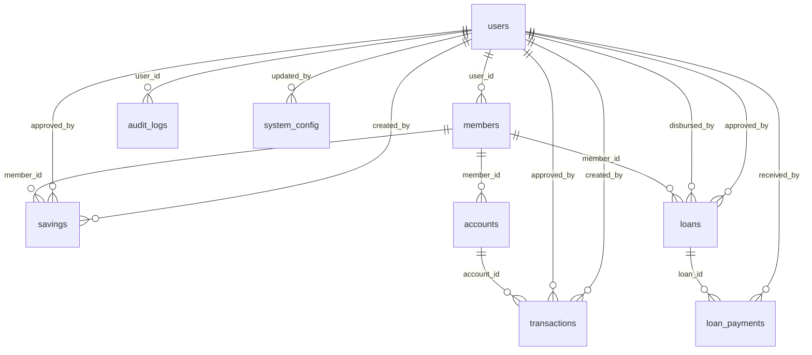

# KSP Lam Gabe Jaya Database Documentation

## 📊 **Database Overview**

Database `gabe` adalah sistem manajemen koperasi simpan pinjam yang dirancang untuk mendukung:
- Multi-role user system (BOS, Admin, Teller, Collector, Nasabah)
- Dynamic navigation system
- SPA-like experience
- Enhanced security dan audit logging
- Real-time reporting

---

## 🏗️ **Database Schema**

### **Core Tables**

#### **`users`** - User Management
```sql
CREATE TABLE `users` (
  `id` int(11) NOT NULL AUTO_INCREMENT,
  `username` varchar(50) NOT NULL,
  `password` varchar(255) NOT NULL,
  `email` varchar(100) DEFAULT NULL,
  `full_name` varchar(100) NOT NULL,
  `phone` varchar(20) DEFAULT NULL,
  `address` text DEFAULT NULL,
  `role` enum('bos','admin','teller','collector','nasabah') NOT NULL DEFAULT 'nasabah',
  `status` enum('active','inactive','suspended') NOT NULL DEFAULT 'active',
  `last_login` datetime DEFAULT NULL,
  `login_attempts` int(11) NOT NULL DEFAULT 0,
  `locked_until` datetime DEFAULT NULL,
  `created_at` timestamp NOT NULL DEFAULT current_timestamp(),
  `updated_at` timestamp NOT NULL DEFAULT current_timestamp() ON UPDATE current_timestamp()
);
```

**Role System:**
- **`bos`**: Full system access, financial reports, user management
- **`admin`**: Operational management, transaction approval, member management
- **`teller`**: Daily transactions, deposit/withdrawal, customer service
- **`collector`**: Field operations, payment collection, route management
- **`nasabah`**: Personal dashboard, account overview, loan applications

#### **`members`** - Member Management
```sql
CREATE TABLE `members` (
  `id` int(11) NOT NULL AUTO_INCREMENT,
  `user_id` int(11) NOT NULL,
  `member_number` varchar(20) NOT NULL,
  `nik` varchar(16) DEFAULT NULL,
  `full_name` varchar(100) NOT NULL,
  `birth_date` date DEFAULT NULL,
  `birth_place` varchar(100) DEFAULT NULL,
  `gender` enum('L','P') DEFAULT NULL,
  `address` text DEFAULT NULL,
  `phone` varchar(20) DEFAULT NULL,
  `email` varchar(100) DEFAULT NULL,
  `join_date` date NOT NULL,
  `status` enum('active','inactive','blacklisted') NOT NULL DEFAULT 'active',
  `photo` varchar(255) DEFAULT NULL,
  `notes` text DEFAULT NULL
);
```

#### **`accounts`** - Account Management
```sql
CREATE TABLE `accounts` (
  `id` int(11) NOT NULL AUTO_INCREMENT,
  `member_id` int(11) NOT NULL,
  `account_number` varchar(20) NOT NULL,
  `account_type` enum('simpanan','pinjaman') NOT NULL,
  `account_name` varchar(100) NOT NULL,
  `balance` decimal(15,2) NOT NULL DEFAULT 0.00,
  `interest_rate` decimal(5,2) DEFAULT NULL,
  `status` enum('active','inactive','closed','frozen') NOT NULL DEFAULT 'active',
  `opened_date` date NOT NULL,
  `closed_date` date DEFAULT NULL,
  `last_transaction_date` date DEFAULT NULL
);
```

#### **`transactions`** - Transaction Management
```sql
CREATE TABLE `transactions` (
  `id` int(11) NOT NULL AUTO_INCREMENT,
  `transaction_code` varchar(20) NOT NULL,
  `account_id` int(11) NOT NULL,
  `transaction_type` enum('debit','credit') NOT NULL,
  `amount` decimal(15,2) NOT NULL,
  `description` varchar(255) DEFAULT NULL,
  `reference_number` varchar(50) DEFAULT NULL,
  `transaction_date` date NOT NULL,
  `transaction_time` time DEFAULT NULL,
  `payment_method` enum('cash','transfer','bank_deposit','digital_payment') DEFAULT 'cash',
  `status` enum('pending','completed','failed','cancelled') NOT NULL DEFAULT 'completed',
  `created_by` int(11) NOT NULL,
  `approved_by` int(11) DEFAULT NULL,
  `notes` text DEFAULT NULL
);
```

**Payment Methods:**
- **`cash`**: Physical cash payment
- **`transfer`**: Bank transfer
- **`bank_deposit`**: Direct bank deposit
- **`digital_payment`**: Digital wallet/payment apps

#### **`savings`** - Savings Management
```sql
CREATE TABLE `savings` (
  `id` int(11) NOT NULL AUTO_INCREMENT,
  `member_id` int(11) NOT NULL,
  `savings_type` enum('wajib','pokok','sukarela','berjangka') NOT NULL,
  `amount` decimal(15,2) NOT NULL,
  `transaction_date` date NOT NULL,
  `transaction_time` time DEFAULT NULL,
  `description` varchar(255) DEFAULT NULL,
  `interest_rate` decimal(5,2) DEFAULT NULL,
  `maturity_date` date DEFAULT NULL,
  `created_by` int(11) NOT NULL,
  `approved_by` int(11) DEFAULT NULL,
  `status` enum('pending','approved','rejected') NOT NULL DEFAULT 'approved'
);
```

**Savings Types:**
- **`wajib`**: Mandatory savings (simpanan wajib)
- **`pokok`**: Principal savings (simpanan pokok)
- **`sukarela`**: Voluntary savings (simpanan sukarela)
- **`berjangka`**: Time deposit savings (simpanan berjangka)

#### **`loans`** - Loan Management
```sql
CREATE TABLE `loans` (
  `id` int(11) NOT NULL AUTO_INCREMENT,
  `member_id` int(11) NOT NULL,
  `loan_number` varchar(20) NOT NULL,
  `loan_amount` decimal(15,2) NOT NULL,
  `interest_rate` decimal(5,2) NOT NULL,
  `loan_term` int(11) NOT NULL COMMENT 'jangka waktu dalam bulan',
  `monthly_payment` decimal(15,2) DEFAULT NULL,
  `purpose` varchar(255) DEFAULT NULL,
  `collateral` text DEFAULT NULL,
  `guarantor` varchar(100) DEFAULT NULL,
  `status` enum('pending','approved','rejected','active','completed','defaulted') NOT NULL DEFAULT 'pending',
  `application_date` date NOT NULL,
  `approval_date` date DEFAULT NULL,
  `disbursement_date` date DEFAULT NULL,
  `due_date` date DEFAULT NULL,
  `approved_by` int(11) DEFAULT NULL,
  `disbursed_by` int(11) DEFAULT NULL
);
```

**Loan Status Flow:**
1. **`pending`** → Loan application submitted
2. **`approved`** → Loan approved by admin
3. **`active`** → Loan disbursed to member
4. **`completed`** → Loan fully paid
5. **`rejected`** → Loan application rejected
6. **`defaulted`** → Loan in default

#### **`loan_payments`** - Loan Payment Management
```sql
CREATE TABLE `loan_payments` (
  `id` int(11) NOT NULL AUTO_INCREMENT,
  `loan_id` int(11) NOT NULL,
  `payment_number` int(11) NOT NULL,
  `amount` decimal(15,2) NOT NULL,
  `principal_amount` decimal(15,2) NOT NULL,
  `interest_amount` decimal(15,2) NOT NULL,
  `late_fee` decimal(15,2) DEFAULT 0.00,
  `payment_date` date NOT NULL,
  `payment_time` time DEFAULT NULL,
  `payment_method` enum('cash','transfer','bank_deposit','digital_payment') NOT NULL DEFAULT 'cash',
  `received_by` int(11) NOT NULL,
  `notes` text DEFAULT NULL,
  `status` enum('pending','completed','failed','cancelled') NOT NULL DEFAULT 'completed'
);
```

---

### **Security & Audit Tables**

#### **`login_attempts`** - Security Monitoring
```sql
CREATE TABLE `login_attempts` (
  `id` int(11) NOT NULL AUTO_INCREMENT,
  `username` varchar(50) NOT NULL,
  `ip_address` varchar(45) NOT NULL,
  `user_agent` varchar(255) DEFAULT NULL,
  `success` tinyint(1) NOT NULL DEFAULT 0,
  `failure_reason` varchar(100) DEFAULT NULL,
  `attempt_time` timestamp NOT NULL DEFAULT current_timestamp()
);
```

**Security Features:**
- Track all login attempts (success/failure)
- IP address logging for security monitoring
- User agent tracking for device identification
- Failure reason categorization

#### **`audit_logs`** - Audit Trail
```sql
CREATE TABLE `audit_logs` (
  `id` int(11) NOT NULL AUTO_INCREMENT,
  `user_id` int(11) DEFAULT NULL,
  `action` varchar(100) NOT NULL,
  `table_name` varchar(50) DEFAULT NULL,
  `record_id` int(11) DEFAULT NULL,
  `old_values` longtext CHARACTER SET utf8mb4 COLLATE utf8mb4_bin DEFAULT NULL CHECK (json_valid(`old_values`)),
  `new_values` longtext CHARACTER SET utf8mb4 COLLATE utf8mb4_bin DEFAULT NULL CHECK (json_valid(`new_values`)),
  `ip_address` varchar(45) DEFAULT NULL,
  `user_agent` varchar(255) DEFAULT NULL,
  `session_id` varchar(255) DEFAULT NULL,
  `created_at` timestamp NOT NULL DEFAULT current_timestamp()
);
```

**Audit Features:**
- JSON storage for old/new values
- Session tracking
- IP and user agent logging
- Table-level audit tracking

---

### **Configuration Tables**

#### **`system_config`** - System Configuration
```sql
CREATE TABLE `system_config` (
  `id` int(11) NOT NULL AUTO_INCREMENT,
  `config_key` varchar(100) NOT NULL,
  `config_value` text DEFAULT NULL,
  `config_type` enum('string','number','boolean','json') NOT NULL DEFAULT 'string',
  `description` varchar(255) DEFAULT NULL,
  `category` varchar(50) DEFAULT 'general',
  `updated_by` int(11) DEFAULT NULL,
  `updated_at` timestamp NOT NULL DEFAULT current_timestamp() ON UPDATE current_timestamp()
);
```

**Configuration Categories:**
- **`general`**: Basic KSP information
- **`savings`**: Savings configuration
- **`loans`**: Loan configuration
- **`security`**: Security settings
- **`features`**: Feature toggles

---

## 📈 **Database Views**

### **`daily_transactions`** - Daily Transaction Summary
```sql
CREATE VIEW `daily_transactions` AS SELECT 
    DATE(t.transaction_date) as transaction_date,
    COUNT(*) as total_transactions,
    SUM(CASE WHEN t.transaction_type = 'credit' THEN 1 ELSE 0 END) as total_credits,
    SUM(CASE WHEN t.transaction_type = 'debit' THEN 1 ELSE 0 END) as total_debits,
    SUM(CASE WHEN t.transaction_type = 'credit' THEN t.amount ELSE -t.amount END) as net_amount,
    SUM(CASE WHEN t.transaction_type = 'credit' THEN t.amount ELSE 0 END) as total_credits_amount,
    SUM(CASE WHEN t.transaction_type = 'debit' THEN t.amount ELSE 0 END) as total_debits_amount
FROM transactions t
WHERE t.status = 'completed'
GROUP BY DATE(t.transaction_date)
ORDER BY transaction_date DESC;
```

### **`loan_performance`** - Loan Performance Dashboard
```sql
CREATE VIEW `loan_performance` AS SELECT 
    l.id, l.loan_number, m.full_name as member_name,
    l.loan_amount, l.interest_rate, l.loan_term, l.status,
    l.application_date, l.disbursement_date,
    COALESCE(SUM(lp.amount), 0) as total_paid,
    l.loan_amount - COALESCE(SUM(lp.amount), 0) as remaining_balance,
    CASE 
        WHEN l.loan_amount - COALESCE(SUM(lp.amount), 0) <= 0 THEN 'completed'
        WHEN l.due_date < CURDATE() AND l.loan_amount - COALESCE(SUM(lp.amount), 0) > 0 THEN 'overdue'
        ELSE 'active'
    END as payment_status
FROM loans l
LEFT JOIN members m ON l.member_id = m.id
LEFT JOIN loan_payments lp ON l.id = lp.loan_id AND lp.status = 'completed'
GROUP BY l.id, l.loan_number, m.full_name, l.loan_amount, l.interest_rate, l.loan_term, l.status, l.application_date, l.disbursement_date
ORDER BY l.application_date DESC;
```

### **`member_summary`** - Member Dashboard Summary
```sql
CREATE VIEW `member_summary` AS SELECT 
    m.id, m.member_number, m.full_name, m.phone, m.email,
    m.join_date, m.status,
    COUNT(DISTINCT a.id) as total_accounts,
    COALESCE(SUM(a.balance), 0) as total_balance,
    COUNT(DISTINCT l.id) as total_loans,
    COALESCE(SUM(l.loan_amount), 0) as total_loan_amount,
    COALESCE(l.loan_amount - COALESCE(SUM(lp.amount), 0), 0) as outstanding_loans
FROM members m
LEFT JOIN accounts a ON m.id = a.member_id AND a.status = 'active'
LEFT JOIN loans l ON m.id = l.member_id AND l.status IN ('active', 'completed')
LEFT JOIN loan_payments lp ON l.id = lp.loan_id AND lp.status = 'completed'
GROUP BY m.id, m.member_number, m.full_name, m.phone, m.email, m.join_date, m.status
ORDER BY m.full_name;
```

---

## 🔗 **Foreign Key Relationships**



---

## 🚀 **Database Performance**

### **Indexes**
- Primary keys on all tables
- Unique constraints on usernames, emails, member numbers, account numbers
- Foreign key indexes for join performance
- Date indexes for transaction queries
- Status indexes for filtering

### **Optimizations**
- UTF8MB4 character set for full Unicode support
- InnoDB engine for transaction support
- JSON validation for audit logs
- Proper foreign key constraints for data integrity

---

## 📊 **Sample Data**

### **Default Users**
| Username | Password | Role | Full Name |
|----------|----------|------|-----------|
| bos | bos | bos | Bos KSP |
| admin | admin | admin | Administrator KSP |
| teller | teller | teller | Teller KSP |
| collector | collector | collector | Collector KSP |
| nasabah | nasabah | nasabah | Ahmad Wijaya |

### **Sample Transactions**
| Transaction Code | Type | Amount | Date | Status |
|------------------|------|--------|------|--------|
| TRX001 | credit | 500,000 | 2024-01-15 | completed |
| TRX002 | credit | 1,000,000 | 2024-01-15 | completed |
| TRX003 | credit | 500,000 | 2024-02-20 | completed |

---

## 🔧 **Database Maintenance**

### **Backup Procedures**
```bash
# Full backup
mysqldump -u root -p gabe > gabe_backup_$(date +%Y%m%d).sql

# Structure only
mysqldump -u root -p --no-data gabe > gabe_structure.sql

# Data only
mysqldump -u root -p --no-create-info gabe > gabe_data.sql
```

### **Restore Procedures**
```bash
# Full restore
mysql -u root -p gabe < gabe_backup_20240322.sql

# Structure only
mysql -u root -p gabe < gabe_structure.sql
```

### **Performance Monitoring**
```sql
-- Check table sizes
SELECT 
    table_name,
    ROUND(((data_length + index_length) / 1024 / 1024), 2) AS 'Size (MB)'
FROM information_schema.tables 
WHERE table_schema = 'gabe'
ORDER BY (data_length + index_length) DESC;

-- Check slow queries
SHOW VARIABLES LIKE 'slow_query_log';
SHOW VARIABLES LIKE 'long_query_time';
```

---

## 🔄 **Version History**

### **v2.0.0** - Current Version
- ✅ Enhanced role system (bos, admin, teller, collector, nasabah)
- ✅ Dynamic navigation support
- ✅ Enhanced security (login attempts, audit logs)
- ✅ Payment method tracking
- ✅ Transaction status management
- ✅ Enhanced reporting views
- ✅ JSON audit logging
- ✅ Session tracking

### **v1.0.0** - Original Version
- ✅ Basic user management
- ✅ Simple transaction tracking
- ✅ Basic loan management
- ✅ Member management

---

## 📞 **Support**

### **Database Connection**
```php
// Connection parameters
$host = 'localhost';
$database = 'gabe';
$username = 'root';
$password = '';
$charset = 'utf8mb4';

// PDO connection
$dsn = "mysql:host=$host;dbname=$database;charset=$charset";
$options = [
    PDO::ATTR_ERRMODE => PDO::ERRMODE_EXCEPTION,
    PDO::ATTR_DEFAULT_FETCH_MODE => PDO::FETCH_ASSOC,
    PDO::ATTR_EMULATE_PREPARES => false,
];
```

### **Troubleshooting**
1. **Connection Issues**: Check MySQL service status
2. **Permission Issues**: Verify user privileges
3. **Character Set**: Ensure UTF8MB4 support
4. **Foreign Keys**: Check InnoDB engine

---

**KSP Lam Gabe Jaya Database v2.0** - Modern Cooperative Management System 🏦✨
